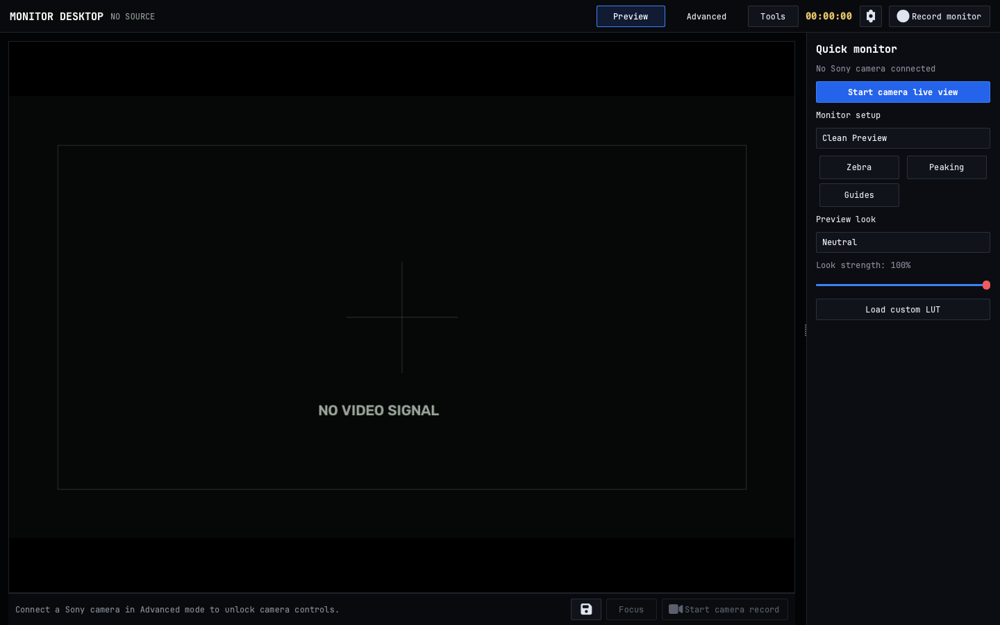
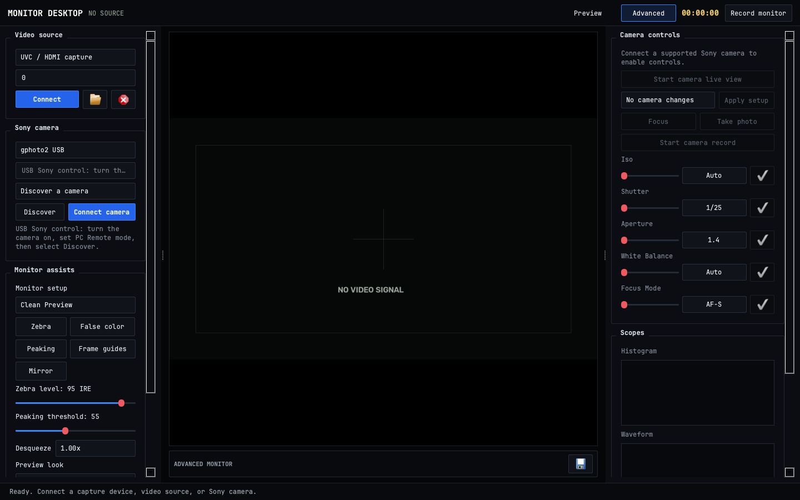
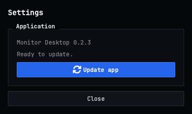

# Monitor Desktop

[](https://github.com/VariableThe/monitor-desktop/actions/workflows/ci.yml)
[](LICENSE)

**Monitor Desktop** is an open-source, local-first field monitor and remote-control surface for Sony cameras. It gives a laptop or desktop the job of a larger production monitor: clean full-screen preview, exposure and focus assists, scopes, monitor looks, recording, and model-dependent Sony control.

It is designed for Linux and macOS. Windows can use capture cards, webcams, local files, and network streams; USB `gphoto2` camera control is currently macOS/Linux only.

| Preview mode | Advanced mode |
| --- | --- |
|  |  |



The screenshots intentionally show an offline monitor state. No camera footage is included in this repository.

## Install and launch

Paste this single line into a macOS or Linux terminal. It downloads the app into an isolated user-local Python environment, installs its dependencies, and launches it:

```bash
curl -fsSL https://raw.githubusercontent.com/VariableThe/monitor-desktop/main/scripts/install.sh | sh && "$HOME/.local/bin/monitor-desktop"
```

The installer requires Python 3.11+, `curl`, and `tar`. It never installs global Python packages. Later launches use:

```bash
~/.local/bin/monitor-desktop
```

To make `monitor-desktop` available without its full path, add this once to your shell profile:

```bash
export PATH="$HOME/.local/bin:$PATH"
```

## Update

Use the gear button in the app's top bar, open **Settings**, then select **Update app**. The update is installed in the existing isolated environment and takes effect after restart. The same update can be run from a terminal:

```bash
curl -fsSL https://raw.githubusercontent.com/VariableThe/monitor-desktop/main/scripts/update.sh | sh
```

For a local source checkout instead:

```bash
./scripts/bootstrap.sh
make run
```

## What it does

- **Two purposeful workspaces:** Preview mode prioritizes the image with a compact quick-tools drawer; Advanced mode exposes source setup, camera controls, assists, looks, and scopes.
- **Video sources:** UVC and HDMI capture devices, webcams, local video files, RTSP, HTTP, and MJPEG streams supported by OpenCV.
- **Monitor assists:** Zebra, false color, focus peaking, frame guides, mirror, anamorphic desqueeze, histogram, waveform, and vectorscope.
- **Looks and LUTs:** Neutral, Warm Film, Soft Matte, Teal and Amber, and Monochrome monitoring looks, plus custom `.cube` LUT preview and strength control.
- **Presets:** Clean Preview, Focus Check, Exposure Check, Framing, and Director's View monitor setups, plus opt-in camera setups and persistent named custom camera setups for compatible bodies.
- **Camera controls:** Sliders scrub through exact camera-supported ISO, shutter, aperture, white balance, and focus values; the value field beside each slider supports direct entry. Remote zoom appears only when the connected transport reports compatible power-zoom support.
- **Local output:** Monitor-feed recording and PNG frame export are written locally under `recordings/`.

## Connecting a Sony camera

Monitor Desktop selects an appropriate transport for the camera and connection style. Camera support is model and firmware dependent; controls remain disabled until a transport has actually connected.

| Transport | Best for | Live view | Controls |
| --- | --- | --- | --- |
| UVC / HDMI capture | Any camera with clean HDMI | Yes | Camera-side only |
| Sony Wi-Fi Remote API | Older compatible Sony cameras on their Wi-Fi network | Yes | Focus, still, movie, and exposure when offered by the body |
| `gphoto2` USB | macOS/Linux tethering and supported Sony Alpha cameras | Yes | Still, focus, settings, and model-dependent movie control |
| Camera Remote SDK server | Current models supported by Sony's SDK | Yes | SDK-server capabilities |

### USB on macOS and Linux

With one compatible USB camera connected, Monitor Desktop auto-connects it after launch, starts camera live view, and opens Preview mode without changing camera settings. With multiple cameras, choose one in **Advanced** mode.

1. Turn the camera on and enable its PC Remote USB mode.
2. In **Advanced**, choose `gphoto2 USB` and press **Discover** if it did not auto-connect.
3. Connect the listed camera, then press **Start camera live view** if it was not started automatically.

The original Sony ZV-E10 works through this path. It is not a current Sony Camera Remote SDK body, so use `gphoto2 USB` for it.

If the Python binding cannot find its system library, install `libgphoto2` and run the installer again:

```bash
# macOS (Homebrew)
brew install libgphoto2

# Debian / Ubuntu
sudo apt install libgphoto2-6 gphoto2
```

Not every Sony body exposes live view or movie recording through libgphoto2.

Remote zoom over USB is more limited than the live-view path. Some Sony bodies expose zoom to `gphoto2` as a writable absolute range, while others do not expose a usable remote zoom control even with a power-zoom lens attached.

### Sony Wi-Fi Remote API

1. Turn on the camera's remote-control application and join this computer to the camera's Wi-Fi network.
2. Choose `Sony Wi-Fi Remote API` and press **Discover**.
3. If discovery is blocked by the network, enter the camera IP address and press **Connect camera**.

This is Sony's earlier JSON-RPC API. For current desktop SDK support, run a compatible local server based on the [Sony Camera Remote SDK](https://support.d-imaging.sony.co.jp/app/sdk/en/index.html), choose `Camera Remote SDK server`, then connect to that server.

## Operating notes

- Use source `0` for the first webcam or capture device. On Linux, `/dev/video0` also works.
- Capture cards are the most universal route for clean, low-latency monitoring. Sony control remains on the camera when using HDMI-only capture.
- Built-in looks are creative monitoring looks, not color-managed replacements for a camera-specific Log-to-Rec.709 transform. Load the matching technical `.cube` LUT when accurate log monitoring is required.
- The app is local-first: footage, LUT files, recordings, and stills stay on the operator's computer.
- In Advanced mode, use the save control beside **Apply setup** to capture the current camera's writable quick settings as a named custom setup. Custom setups persist on the workstation and safely skip values unsupported by a different connected body.

## Development

```bash
make check
make screenshots
```

`make check` compiles the application and runs the unit tests. GitHub Actions runs the same checks on Python 3.11 and 3.12. The screenshot command always forces an offline state, avoiding a connected camera and any live camera image.

See [CONTRIBUTING.md](CONTRIBUTING.md) for contribution expectations and [the issue tracker](https://github.com/VariableThe/monitor-desktop/issues) for bugs and feature requests.

## Project status

Monitor Desktop is an early, usable foundation rather than feature parity with every Monitor+ release or Sony body. High-value next steps are click-to-focus coordinate mapping, media transfer, audio capture, broader hardware verification, and native installers.

## License

Monitor Desktop is released under the [MIT License](LICENSE). `gphoto2`, OpenCV, PySide6, QtAwesome, and Sony Camera Remote SDK components remain separate projects under their own licenses. JetBrains Mono Regular and Bold are bundled under the [SIL Open Font License 1.1](monitor_desktop/assets/fonts/OFL.txt); QtAwesome bundles Font Awesome under its respective font license.
